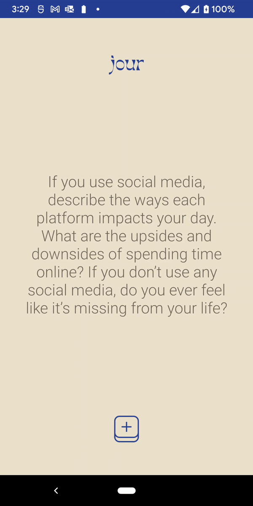

# jour

A phone app to give you randomized journaling prompts. 

  

# Personalizing the app

# License

MIT License. 

# References

https://medium.com/stoicism-philosophy-as-a-way-of-life/9-stoic-journal-prompts-a-simple-approach-to-daily-journaling-a0022b1c1bc0
https://medium.com/the-happy-human/the-ultimate-list-of-self-discovery-journaling-prompts-8e3296b0b662
https://nesslabs.com/journaling-prompts
https://www.silkandsonder.com/blogs/news/50-journaling-prompts-for-self-love
https://www.rebekah-joan.com/blog/personal-growth-journal-prompts
https://www.selfloverainbow.com/2016/08/journaling-prompts-self-love.html